### Now

- 🏥 **Medical Operations and Data @ Tandem** — deploying ambient clinical AI across NHS hospitals
- 🔬 **AI safety research** — chain-of-thought monitoring (Algoverse) · LLM guardrails (HUX AI)
- 🧪 Latest: [*Is functional welfare speakable?*](https://latentmindsinstitute.com/speakable-welfare/) — RL-trained welfare directions vs. the Jacobian-lens verbalizable subspace
- ⚖️ [Medical Debate](https://github.com/PS5138/llm_debate) — debate as a scalable oversight for medical diagnosis

